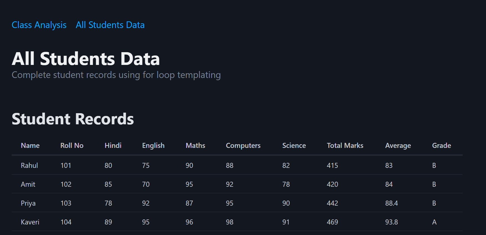
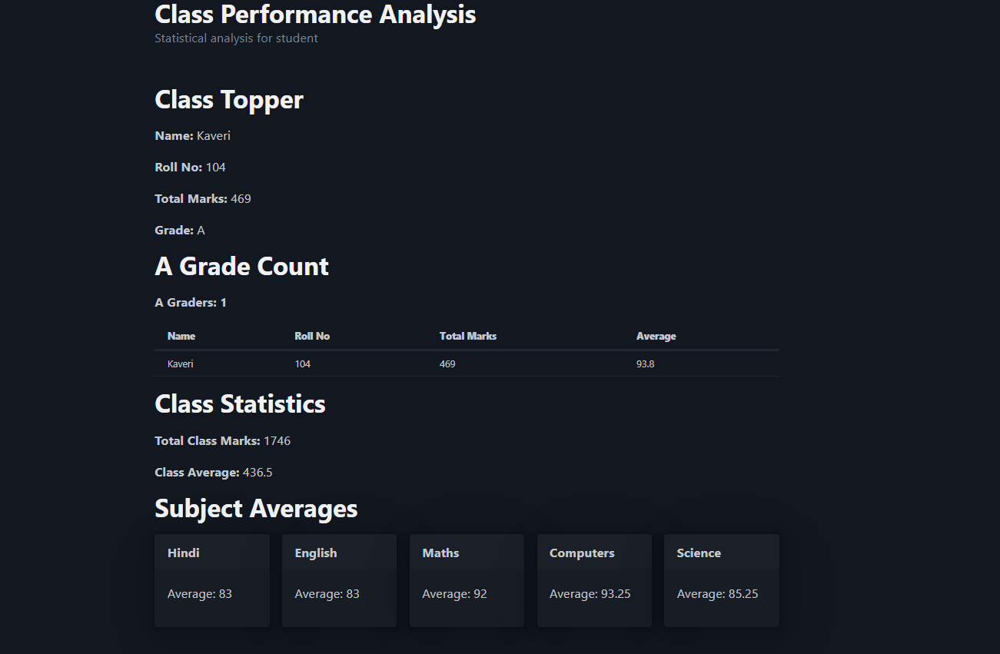

# 📊 Class Performance Analysis

  
  
  
  

---

## 🔍 Purpose

This app is built to:
The **Class Performance Analysis App** is a web-based tool that helps track and analyze students’ academic performance.  
It provides detailed insights like class topper, A-grade count, subject-wise averages, and overall class performance

- Analyze **class performance**.  
- Display key insights like:  
  - 🏆 **Class Topper**  
  - 🅰️ **A-grade Count**  
  - 📊 **Total Marks**  
  - 📈 **Class Average**  
  - 📚 **Subject-wise Averages**  
- Show data in a **tabular format** with clear visualization.  
- Navigate through **class Analysis and All student data**.  

---

***

## 🚀 Tech Stack

> HTML  

> PICO CSS   
---

***

## [GO LIVE](https://codesandbox.io/p/sandbox/class-performance-app)  

  
---  
  
---  

## 🧭 Core Features

- 🏆 **Class Topper Identification**  
- 🅰️ **A-grade Student Counter**  
- 📊 **Overall Marks & Average Calculation**  
- 📚 **Subject-wise Averages** (Maths, Science, etc.)  
- 📖 **Tabular UI** for clarity and performance comparison    

---

## 🛠️ Installation

```bash
git clone https://github.com/Sourabhpande532/BlueberryClassStats.git
```
***
## Skills Gained in the Project

- Aggregating & analyzing performance data (averages, topper, counts).

- Designing clean tabular UIs using semantic HTML & Pico.css.

